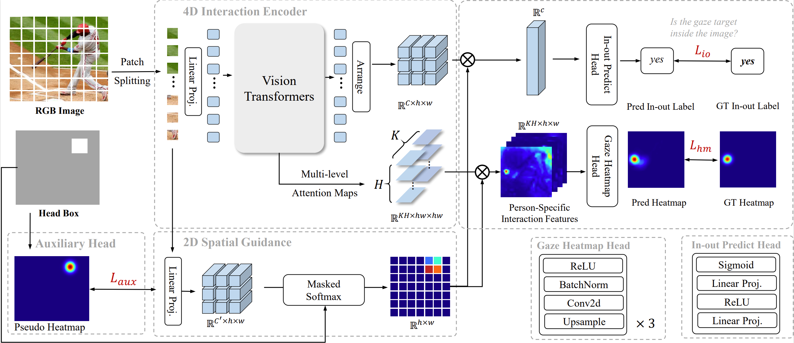
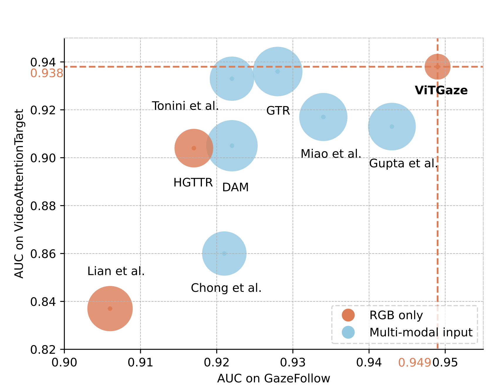

<div align="center">
<h1>ViTGaze 👀</h1>
<h3>Gaze Following with Interaction Features in Vision Transformers</h3>

Yuehao Song<sup>1</sup> , Xinggang Wang<sup>1 :email:</sup> , Jingfeng Yao<sup>1</sup> , Wenyu Liu<sup>1</sup> , Jinglin Zhang<sup>2</sup> , Xiangmin Xu<sup>3</sup>

<sup>1</sup> Huazhong University of Science and Technology, <sup>2</sup> Shandong University, <sup>3</sup> South China University of Technology

(<sup>:email:</sup>) corresponding author.

ArXiv Preprint ([arXiv 2403.12778](https://arxiv.org/abs/2403.12778))

</div>

#


### News
* **`Mar. 25th, 2024`:** We release an initial version of ViTGaze.
* **`Mar. 19th, 2024`:** We released our paper on Arxiv. Code/Models are coming soon. Please stay tuned! ☕️


## Introduction
<div align="center"><h5>Plain Vision Transformer could also do gaze following with the simple ViTGaze framework!</h5></div>



Inspired by the remarkable success of pre-trained plain Vision Transformers (ViTs), we introduce a novel single-modality gaze following framework, **ViTGaze**. In contrast to previous methods, it creates a brand new gaze following framework based mainly on powerful encoders (relative decoder parameter less than 1%). Our principal insight lies in that the inter-token interactions within self-attention can be transferred to interactions between humans and scenes. Our method achieves state-of-the-art (SOTA) performance among all single-modality methods (3.4% improvement on AUC, 5.1% improvement on AP) and very comparable performance against multi-modality methods with 59% number of parameters less.

## Results
> Results from the [ViTGaze paper](https://arxiv.org/abs/2403.12778)



<table align="center">
  <tr>
    <th colspan="3">Results on <a herf=http://gazefollow.csail.mit.edu/index.html>GazeFollow</a></th>
    <th colspan="3">Results on <a herf=https://github.com/ejcgt/attention-target-detection>VideoAttentionTarget</a></th>
  </tr>
  <tr>
    <td><b>AUC</b></td>
    <td><b>Avg. Dist.</b></td>
    <td><b>Min. Dist.</b></td>
    <td><b>AUC</b></td>
    <td><b>Dist.</b></td>
    <td><b>AP</b></td>
  </tr>
  <tr>
    <td>0.949</td>
    <td>0.105</td>
    <td>0.047</td>
    <td>0.938</td>
    <td>0.102</td>
    <td>0.905</td>
  </tr>
</table>

Corresponding checkpoints are released:
- GazeFollow: [GoogleDrive](https://drive.google.com/file/d/164c4woGCmUI8UrM7GEKQrV1FbA3vGwP4/view?usp=drive_link)
- VideoAttentionTarget: [GoogleDrive](https://drive.google.com/file/d/11_O4Jm5wsvQ8qfLLgTlrudqSNvvepsV0/view?usp=drive_link)
## Getting Started
- [Installation](docs/install.md)
- [Train](docs/train.md)
- [Eval](docs/eval.md)

## Acknowledgements
ViTGaze is based on [detectron2](https://github.com/facebookresearch/detectron2). We use the efficient multi-head attention implemented in the [xFormers](https://github.com/facebookresearch/xformers) library.

## Citation
If you find ViTGaze is useful in your research or applications, please consider giving us a star 🌟 and citing it by the following BibTeX entry.
```bibtex
@article{vitgaze,
    title={ViTGaze: Gaze Following with Interaction Features in Vision Transformers},
    author={Yuehao Song and Xinggang Wang and Jingfeng Yao and Wenyu Liu and Jinglin Zhang and Xiangmin Xu},
    journal={arXiv preprint arXiv:2403.12778},
    year={2024}
}
```
